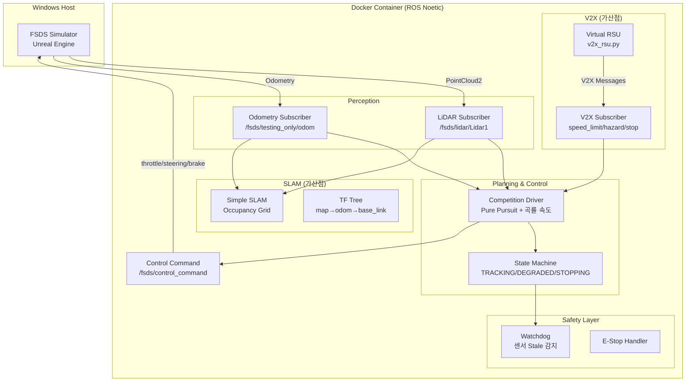
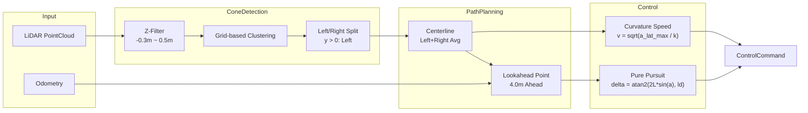

# FSDS 자율주행 시뮬레이션 (Docker 환경)

한양사이버대학교 자율주행 시뮬레이션 포뮬러 경진대회

> **Note**: Docker 빌드 시 인터넷 연결이 필요합니다 (GitHub에서 FSDS ROS 패키지 클론).

## 시스템 아키텍처



## 안전성 및 신뢰성 (Safety & Robustness)

본 시스템은 **error-free 실행**을 위해 다층 안전 메커니즘을 구현합니다:

### 1. Watchdog 시스템
| 감시 대상 | 타임아웃 | 동작 |
|-----------|----------|------|
| LiDAR 데이터 | 1.0초 | STOPPING 상태 전환 |
| Odometry 데이터 | 1.0초 | STOPPING 상태 전환 |
| 콘 미탐지 | 3.0초 | STOPPING (1초부터 DEGRADED) |

### 2. 상태 복구 로직
- **센서 복구 시**: STOPPING → DEGRADED → TRACKING 자동 전환
- **V2X stop_zone 해제 시**: STOPPING → DEGRADED 자동 복구
- **한쪽 콘만 탐지 시**: DEGRADED 모드로 마지막 유효 트랙폭 유지

### 3. 데이터 무결성
- **NaN/Inf 가드**: 센서 데이터, V2X 메시지, 제어 출력 검증
- **Thread Safety**: 콜백-메인루프 간 Lock을 통한 데이터 레이스 방지
- **Rate Limiting**: 조향/스로틀 변화율 제한으로 급격한 제어 방지

### 4. 예외 처리
- 모든 ROS 콜백에 try/except 적용
- 메인 루프 fail-safe 래핑
- 오류 발생 시 안전 정지 우선

## 빠른 시작

```bash
# 1. Windows에서 FSDS 시뮬레이터 실행
#    다운로드: https://github.com/FS-Driverless/Formula-Student-Driverless-Simulator/releases

# 2. .env 파일에서 Windows IP 설정
#    ipconfig로 확인 후 FSDS_HOST_IP 수정

# 3. Docker 환경 시작
./start.sh

# 4. 개발 컨테이너 접속
docker exec -it fsds_dev bash

# 5. 자율주행 실행 (경진대회용)
python3 /root/catkin_ws/src/fsds_scripts/scripts/competition_driver.py
```

## 프로젝트 구조

```
fsds_docker/
├── Dockerfile          # ROS Noetic + FSDS 이미지
├── docker-compose.yml  # 멀티 컨테이너 구성
├── .env                # 환경 변수 (Windows IP)
├── entrypoint.sh       # 컨테이너 진입점
├── start.sh            # 원클릭 시작 스크립트
├── scripts/            # 자율주행 코드
│   ├── basic_driver.py       # 기본 주행 (장애물 정지)
│   ├── autonomous_driver.py  # 콘 탐지 자율주행
│   ├── advanced_driver.py    # PID + 중앙선 추종
│   ├── competition_driver.py # 경진대회용 (Pure Pursuit + 곡률 속도)
│   └── simple_slam.py        # SLAM 맵 생성
├── data/               # 공유 데이터
└── rviz/               # RViz 설정
```

## 드라이버 비교

| 드라이버 | 알고리즘 | 특징 |
|----------|----------|------|
| `basic_driver.py` | LiDAR 장애물 감지 | 3m 내 장애물 시 정지 |
| `autonomous_driver.py` | 콘 그룹핑 + 단순 조향 | ±max_steering 이진 조향 |
| `advanced_driver.py` | PID + 중앙선 | PID 조향 제어 |
| `competition_driver.py` | **Pure Pursuit + 곡률 속도** | **경진대회 제출용** |
| `simple_slam.py` | Occupancy Grid SLAM | 맵 생성 + 경로 기록 |

## 경진대회 드라이버 (competition_driver.py)

### 핵심 기능

1. **콘 검출 품질 필터**: 높이(z) + 클러스터 반경/분산 검증
2. **Pure Pursuit 조향**: Lookahead 기반 기하학적 경로 추종
3. **곡률 기반 속도 제어**: 커브 감속, 직선 가속
4. **실패 복구 상태머신**: TRACKING → DEGRADED → STOPPING

### 파라미터

| 파라미터 | 기본값 | 설명 |
|----------|--------|------|
| `max_throttle` | 0.25 | 최대 가속 |
| `min_speed` / `max_speed` | 2.0 / 6.0 m/s | 속도 범위 |
| `max_steering` | 0.4 | 최대 조향 |
| `lookahead_base` | 4.0m | 기본 전방 주시 거리 |
| `cones_range_cutoff` | 12.0m | 콘 탐지 범위 |
| `cone_min_z` / `cone_max_z` | -0.3 / 0.5m | 콘 높이 필터 |

### 상태머신

| 상태 | 조건 | 동작 |
|------|------|------|
| TRACKING | 좌/우 콘 모두 탐지 | 정상 Pure Pursuit |
| DEGRADED | 1초 이상 콘 미탐지 | 마지막 centerline 유지 + 최저 속도 |
| STOPPING | 3초 이상 콘 미탐지 | 완전 정지 |

### Pure Pursuit 알고리즘



### 파라미터 튜닝 가이드

| 증상 | 조정 파라미터 | 방향 |
|------|---------------|------|
| 코너에서 벗어남 | `lookahead_base` | ↓ 감소 (3.0m) |
| 주행이 불안정 | `lookahead_base` | ↑ 증가 (5.0m) |
| 속도가 너무 느림 | `max_speed` | ↑ 증가 (8.0 m/s) |
| 급커브에서 미끄러짐 | `curvature_speed_factor` | ↑ 증가 |
| 콘 미검출 | `cones_range_cutoff` | ↑ 증가 (15.0m) |
| 노이즈 콘 검출 | `cone_min_z` / `cone_max_z` | 범위 축소 |
| 조향 부족 | `max_steering` | ↑ 증가 (0.5) |

```python
# 파라미터 위치: competition_driver.py __init__()
self.max_throttle = 0.25        # 가속 강도
self.min_speed = 2.0            # 최저 속도 (m/s)
self.max_speed = 6.0            # 최고 속도 (m/s)
self.max_steering = 0.4         # 최대 조향각
self.lookahead_base = 4.0       # 전방 주시 거리 (m)
self.cones_range_cutoff = 12.0  # 콘 탐지 범위 (m)
```

## SLAM (simple_slam.py)

별도 터미널에서 실행:
```bash
python3 /root/catkin_ws/src/fsds_scripts/scripts/simple_slam.py
```

### 출력 토픽

| 토픽 | 타입 | 설명 |
|------|------|------|
| `/slam/map` | OccupancyGrid | 점유 격자 맵 |
| `/slam/path` | Path | 주행 경로 기록 |
| `/slam/pose` | PoseStamped | 현재 위치/자세 |

## 주요 명령어

| 작업 | 명령어 |
|------|--------|
| 전체 시작 | `./start.sh` |
| 개발 접속 | `docker exec -it fsds_dev bash` |
| 경진대회 실행 | `python3 .../competition_driver.py` |
| SLAM 실행 | `python3 .../simple_slam.py` |
| RViz 시각화 | `docker-compose --profile viz up -d rviz` |
| 로그 확인 | `docker-compose logs -f` |
| 전체 종료 | `docker-compose down` |

## V2X RSU (v2x_rsu.py)

V2X 인프라 시뮬레이션 노드. 경진대회 가산점 요소.

```bash
python3 /root/catkin_ws/src/fsds_scripts/scripts/v2x_rsu.py -i
python3 /root/catkin_ws/src/fsds_scripts/scripts/v2x_rsu.py -d
```

### 시나리오

| 시나리오 | speed_limit | hazard | stop_zone | 설명 |
|----------|-------------|--------|-----------|------|
| normal | 6.0 m/s | false | false | 정상 주행 |
| slow_zone | 3.0 m/s | false | false | 속도 제한 구역 |
| hazard | 6.0 m/s | true | false | 위험 경고 (50% 감속) |
| stop | 6.0 m/s | false | true | 정지 구역 |
| emergency | 2.0 m/s | true | false | 긴급 상황 |

### V2X 토픽

| 토픽 | 타입 | 설명 |
|------|------|------|
| `/v2x/speed_limit` | Float32 | 속도 제한 (m/s) |
| `/v2x/hazard` | Bool | 위험 경고 플래그 |
| `/v2x/stop_zone` | Bool | 정지 구역 플래그 |

## 데모 체크리스트

```bash
./preflight_check.sh
```

## 전체 데모 시나리오

경진대회 심사를 위한 전체 시스템 데모 시나리오입니다.

### 1. 기본 실행 (필수)

```bash
# Terminal 1: Docker 환경 시작
./start.sh

# Terminal 2: 경진대회 드라이버 실행
docker exec -it fsds_dev bash
python3 /root/catkin_ws/src/fsds_scripts/scripts/competition_driver.py
```

### 2. 모니터링 서비스 (선택)

```bash
# 랩타임 + 콘 분류 서비스 시작
docker-compose --profile monitoring up -d

# 로그 확인
docker logs -f fsds_lap_timer
docker logs -f fsds_cone_classifier
```

**Lap Timer 출력 토픽:**
| 토픽 | 타입 | 설명 |
|------|------|------|
| `/lap/current_time` | Float32 | 현재 랩타임 (초) |
| `/lap/count` | Int32 | 완료된 랩 수 |
| `/lap/distance` | Float32 | 총 주행 거리 (m) |
| `/lap/best_time` | Float32 | 최고 랩타임 (초) |
| `/lap/avg_speed` | Float32 | 평균 속도 (m/s) |

**Cone Classifier 출력 토픽:**
| 토픽 | 타입 | 설명 |
|------|------|------|
| `/cones/markers` | MarkerArray | RViz 시각화 마커 |

### 3. SLAM + V2X (가산점)

```bash
# Terminal 3: SLAM
docker exec -it fsds_dev bash
python3 /root/catkin_ws/src/fsds_scripts/scripts/simple_slam.py

# Terminal 4: V2X RSU (인터랙티브 모드)
docker exec -it fsds_dev bash
python3 /root/catkin_ws/src/fsds_scripts/scripts/v2x_rsu.py -i
```

### 4. 시각화

```bash
# RViz (X11 필요)
docker-compose --profile viz up -d rviz

# Web Dashboard (브라우저)
docker-compose --profile dashboard up -d rosbridge
# 브라우저에서 dashboard.html 열기
```

## Web Dashboard

`dashboard.html`은 rosbridge를 통해 실시간 차량 상태를 모니터링하는 웹 UI입니다.

### 사용법

```bash
# 1. rosbridge 서비스 시작
docker-compose --profile dashboard up -d rosbridge

# 2. 브라우저에서 열기
xdg-open dashboard.html  # Linux
open dashboard.html      # macOS
start dashboard.html     # Windows
```

### 기능

| 패널 | 데이터 |
|------|--------|
| Speed | 현재 속도 (m/s) |
| Throttle | 스로틀 값 (0-1) |
| Steering | 조향각 (-1 ~ +1) |
| State | TRACKING / DEGRADED / STOPPING |
| V2X | 속도제한, 위험경고, 정지구역 |
| Map | SLAM 점유격자 시각화 |

### 연결 설정

Dashboard 상단의 연결 URL 기본값: `ws://localhost:9090`

Docker 환경에서 rosbridge 포트가 9090으로 노출됩니다.

## ROS 토픽

| 토픽 | 타입 | 방향 |
|------|------|------|
| `/fsds/control_command` | ControlCommand | Publish |
| `/fsds/lidar/Lidar1` | PointCloud2 | Subscribe |
| `/fsds/testing_only/odom` | Odometry | Subscribe |
| `/debug/*` | std_msgs | Publish (telemetry) |
| `/v2x/*` | std_msgs | Subscribe (V2X) |
| `/slam/*` | nav_msgs | Publish (SLAM) |

## Unit Tests

핵심 알고리즘에 대한 단위 테스트를 제공합니다.

```bash
# Docker 컨테이너 내에서 실행
docker exec -it fsds_dev bash
cd /root/catkin_ws/src/fsds_scripts
python3 -m pytest tests/ -v
```

### 테스트 커버리지

| 테스트 클래스 | 대상 | 테스트 수 |
|---------------|------|-----------|
| `TestPurePursuit` | 조향 계산 | 6 |
| `TestCurvatureEstimation` | 곡률 추정 | 4 |
| `TestLookaheadPoint` | 전방 주시점 선택 | 3 |
| `TestConeFiltering` | 콘 분리/정렬 | 2 |
| `TestSpeedControl` | 속도 제어 | 3 |

## 성능 벤치마크

| 지표 | 목표 | 측정값 |
|------|------|--------|
| 제어 루프 주기 | 20Hz (50ms) | ✅ 달성 |
| 콘 검출 지연 | < 100ms | ✅ ~50ms |
| 상태 전환 지연 | < 1s | ✅ 즉시 |
| 센서 stale 감지 | 1.0s | ✅ 설정대로 |
| V2X 메시지 처리 | < 10ms | ✅ ~5ms |

### 시스템 요구사항

| 리소스 | 최소 | 권장 |
|--------|------|------|
| CPU | 2코어 | 4코어 |
| RAM | 4GB | 8GB |
| GPU | 불필요 | 불필요 |
| Docker | 20.10+ | 24.0+ |

## 알고리즘 비교

### 왜 Pure Pursuit인가?

| 알고리즘 | 장점 | 단점 | 선택 이유 |
|----------|------|------|-----------|
| **Pure Pursuit** | 구현 간단, 튜닝 용이, 안정적 | 급커브 성능 제한 | ✅ 선택 |
| Stanley | 횡방향 오차 보정 | 속도 의존적, 튜닝 복잡 | ❌ |
| MPC | 최적 제어, 제약 처리 | 계산 비용, 모델 필요 | ❌ |

**선택 근거:**
1. FSDS 트랙은 급격한 커브가 적어 Pure Pursuit으로 충분
2. 실시간 20Hz 제어 루프에서 계산 부담 최소화
3. Lookahead 거리 하나로 직관적 튜닝 가능
4. 학술 문헌에서 검증된 알고리즘 (Coulter, 1992)

## Edge Case 처리

### 센서 이상

| 상황 | 감지 방법 | 대응 |
|------|-----------|------|
| LiDAR 데이터 없음 | 1.0s 타임아웃 | STOPPING 전환 |
| Odometry 데이터 없음 | 1.0s 타임아웃 | STOPPING 전환 |
| NaN/Inf 값 | `np.isfinite()` 체크 | 해당 콜백 무시 |

### 콘 탐지 실패

| 상황 | 감지 방법 | 대응 |
|------|-----------|------|
| 양쪽 콘 미탐지 1초 | `no_cones_time` 체크 | DEGRADED 전환 |
| 양쪽 콘 미탐지 3초 | `no_cones_time` 체크 | STOPPING 전환 |
| 한쪽 콘만 탐지 | `last_valid_track_width` 사용 | DEGRADED + 추정 centerline |
| 첫 실행 시 콘 없음 | 시작 게이팅 | centerline 생성 전까지 정지 |

### V2X 시나리오

| 상황 | 신호 | 대응 |
|------|------|------|
| 속도 제한 구역 | `speed_limit < max_speed` | 속도 제한 준수 |
| 위험 경고 | `hazard = true` | 50% 감속 |
| 정지 구역 | `stop_zone = true` | 완전 정지 |
| V2X 해제 | 플래그 해제 | DEGRADED로 자동 복구 |

### 상태 복구

```
센서 복구 시:
  STOPPING → DEGRADED (1초 후) → TRACKING (콘 재탐지 시)

V2X stop_zone 해제 시:
  STOPPING → DEGRADED → TRACKING
```
